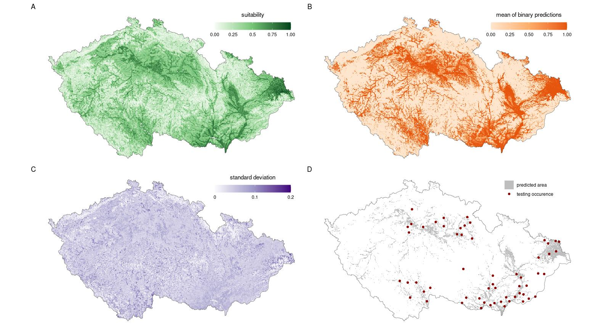

Results and source code to reproduce analysis from https://doi.org/10.1016/j.heliyon.2023.e14826:

Holuša J. and Kaláb O. (2023) The habitat-suitability models of the European mole cricket (_Gryllotalpa gryllotalpa_) as information tool for conservation and pest management. *Heliyon*. 9(4) e14826

