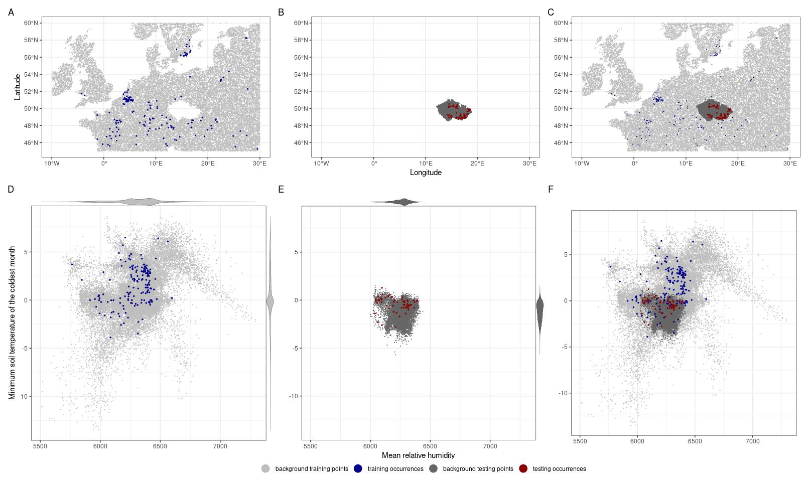

---
output:
  md_document:
    variant: markdown_github
---

```{r, include=FALSE}
library(sdm)
library(raster)
library(knitr)
eval_names  <- c("Sensitivity","Threshold","Boyce","SEDI")
eval_dep <- round(read.csv("eval_dep.csv",row.names="X"),2)
eval_dep <- eval_dep[-1,]
rownames(eval_dep) <- eval_names

pr_sd_stats <- read.csv("pr_sd_stats.csv")
pr_sd_stats <- pr_sd_stats[,-1]
pr_sd_stats$val <- round(pr_sd_stats$val,2)

eval_indep <- round(read.csv("eval_indep.csv",row.names="X"),2)
eval_indep <- eval_indep[-1,]
rownames(eval_indep) <- eval_names

eval_ens <- round(read.csv("eval_ens.csv",row.names="X"),3)
rownames(eval_ens)  <- c("Binomial p-value","Binomial prob.","Sensitivity","Boyce","SEDI")
names(eval_ens)  <- c("value")

climan_r <- raster("climan_r.grd")
unc <- raster("unc_sd.grd")

m <- readRDS(file.path("model.RDS"))
var_imp <- getVarImp(m,wtest="test.dep")@varImportanceMean$corTest[2]*100
var_imp <- data.frame(var = row.names(var_imp), corTest.dep = var_imp[,1])
```
# Results overwiev

Mean variable permutation contribution

```{r, echo=FALSE}
kable(var_imp[order(var_imp[,2],decreasing=T),])
```

Dependent tests

```{r, echo=FALSE}
kable(eval_dep)
```

Independent tests

```{r, echo=FALSE}
kable(eval_indep)
```

Tests of ensembles

```{r, echo=FALSE}
kable(eval_ens)
```
Summary of uncertainty raster

```{r, echo=FALSE}
kable(pr_sd_stats)
```

Prediction maps


Bivariate map of suitability and uncertainty


Data in evnironmetal and geographical space


Response curves

