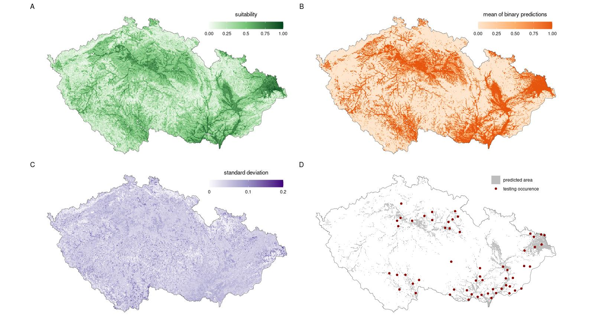
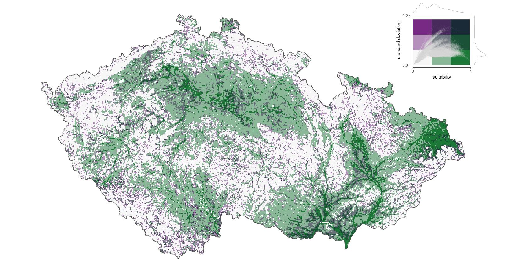
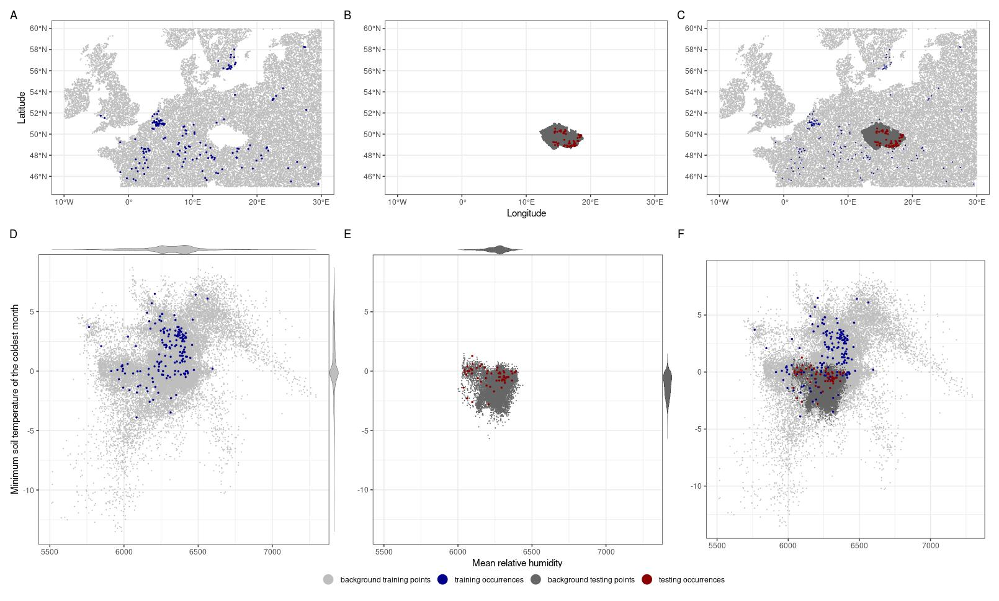
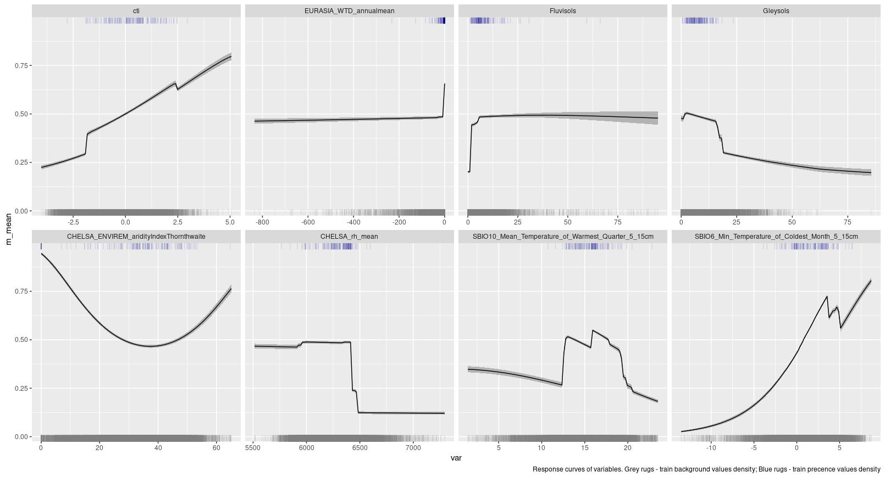

Results overwiev
================

Mean variable permutation contribution

|     | var                                                      |  corTest.dep|
|:----|:---------------------------------------------------------|------------:|
| 6   | CHELSA\_rh\_mean                                         |      30.0296|
| 8   | SBIO6\_Min\_Temperature\_of\_Coldest\_Month\_5\_15cm     |      23.2278|
| 5   | CHELSA\_ENVIREM\_aridityIndexThornthwaite                |      13.2438|
| 7   | SBIO10\_Mean\_Temperature\_of\_Warmest\_Quarter\_5\_15cm |      12.3792|
| 3   | Fluvisols                                                |      10.8850|
| 1   | cti                                                      |       8.8784|
| 2   | EURASIA\_WTD\_annualmean                                 |       5.0472|
| 4   | Gleysols                                                 |       3.9514|

Dependent tests

|             |  mean|    sd|   max|   min|
|:------------|-----:|-----:|-----:|-----:|
| Sensitivity |  0.72|  0.12|  0.94|  0.52|
| Threshold   |  0.57|  0.11|  0.82|  0.31|
| Boyce       |  0.79|  0.09|  0.95|  0.57|
| SEDI        |  0.57|  0.06|  0.77|  0.45|

Independent tests

|             |  mean|    sd|   max|   min|
|:------------|-----:|-----:|-----:|-----:|
| Sensitivity |  0.73|  0.11|  0.96|  0.54|
| Threshold   |  0.44|  0.08|  0.60|  0.27|
| Boyce       |  0.67|  0.10|  0.92|  0.37|
| SEDI        |  0.55|  0.03|  0.61|  0.46|

Tests of ensembles

|                  |  value|
|:-----------------|------:|
| Binomial p-value |  0.000|
| Binomial prob.   |  0.088|
| Sensitivity      |  0.474|
| Boyce            |  0.862|
| SEDI             |  0.530|

Summary of uncertainty raster

| stat |   val|
|:-----|-----:|
| min  |  0.01|
| max  |  0.20|
| mean |  0.05|
| sd   |  0.02|

Prediction maps 

Bivariate map of suitability and uncertainty

Data in evnironmetal and geographical space

Response curves 
